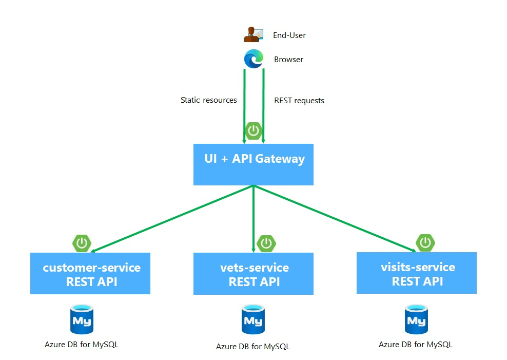

# Distributed version of the Spring PetClinic Sample Application deployed to ARO

[](https://github.com/spring-petclinic/spring-petclinic-microservices/actions/workflows/maven-build.yml)
[](https://opensource.org/licenses/Apache-2.0)

This microservices branch was initially derived from [AngularJS version](https://github.com/spring-petclinic/spring-petclinic-angular1) to demonstrate how to split sample Spring application into [microservices](http://www.martinfowler.com/articles/microservices.html).
To achieve that goal we use IaC with Azure Bicep, MS build of OpenJDK 11, GitHub Actions, Azure Container Registry, Azure AD Workload Identity, Azure Key Vault, Open Service Mesh (OSM), Azure Database for MySQL

## Create Infra

See [iac/bicep/README.md](iac/bicep/README.md)

## Starting services locally without Docker

Quick local test just to verify that the jar files can be run (the routing will not work out of a K8S cluster): 
```sh
mvn package -Dmaven.test.skip=true
java -jar spring-petclinic-config-server\target\spring-petclinic-config-server-2.6.1.jar --server.port=8888
java -jar spring-petclinic-admin-server\target\spring-petclinic-admin-server-2.6.1.jar --server.port=9090
java -jar spring-petclinic-visits-service\target\spring-petclinic-visits-service-2.6.1.jar --server.port=8082 # --spring.profiles.active=docker
java -jar spring-petclinic-vets-service\target\spring-petclinic-vets-service-2.6.1.jar --server.port=8083
java -jar spring-petclinic-customers-service\target\spring-petclinic-customers-service-2.6.1.jar --server.port=8084
java -jar spring-petclinic-api-gateway\target\spring-petclinic-api-gateway-2.6.1.jar --server.port=8085
```

Every microservice is a Spring Boot application and can be started locally using IDE ([Lombok](https://projectlombok.org/) plugin has to be set up) or `../mvnw spring-boot:run` command. Please note that supporting services (Config and Discovery Server) must be started before any other application (Customers, Vets, Visits and API).
Startup of Tracing server, Admin server, Grafana and Prometheus is optional.
If everything goes well, you can access the following services at given location:
* AngularJS frontend (API Gateway) - http://localhost:8080
* Admin Server (Spring Boot Admin) - http://localhost:9090


The `master` branch uses an MS openjdk/jdk:11-mariner Docker base.


## Understanding the Spring Petclinic application

[See the presentation of the Spring Petclinic Framework version](http://fr.slideshare.net/AntoineRey/spring-framework-petclinic-sample-application)

[A blog bost introducing the Spring Petclinic Microsevices](http://javaetmoi.com/2018/10/architecture-microservices-avec-spring-cloud/) (french language)

You can then access petclinic here: http://localhost:8080/


**Architecture diagram of the Spring Petclinic Microservices**



The UI code is located at spring-petclinic-api-gateway\src\main\resources\static\scripts.

If you want to know more about the Spring Boot Admin server, you might be interested in [https://github.com/codecentric/spring-boot-admin](https://github.com/codecentric/spring-boot-admin)


## Fork the Config repo
Fork [https://github.com/ezYakaEagle442/spring-petclinic-microservices-config](https://github.com/ezYakaEagle442/spring-petclinic-microservices-config)

## Database configuration

In its default configuration, Petclinic uses an in-memory database (HSQLDB) which gets populated at startup with data.
A similar setup is provided for MySql in case a persistent database configuration is needed.
Dependency for Connector/J, the MySQL JDBC driver is already included in the `pom.xml` files.

### Set MySql connection String

You need to reconfigure the MySQL connection string with your own settings (you can get it from the Azure portal / petcliaro-mysql-server / Connection strings / JDBC):
In the spring-petclinic-microservices-config/blob/main/application.yml :
```
spring:
  config:
    activate:
      on-profile: mysql
  datasource:
    schema: classpath*:db/mysql/schema.sql
    data: classpath*:db/mysql/data.sql
    # url: jdbc:mysql://localhost:3306/petclinic?useSSL=false
    url: jdbc:mysql://petcliaro-mysql-server.mysql.database.azure.com:3306/petclinic?useSSL=true";myDbConn=DriverManager.getConnection(url, "mys_adm", "Your Password set in Bicep iac/bicep/mysql/parameters-mysql.json / administratorLoginPassword");
    #username: root
    #password: petclinic
    initialization-mode: ALWAYS
```

### Use the Spring 'mysql' profile

To use a MySQL database, you have to start 3 microservices (`visits-service`, `customers-service` and `vets-services`)
with the `mysql` Spring profile. Add the `--spring.profiles.active=mysql` as programm argument.

By default, at startup, database schema will be created and data will be populated.
You may also manually create the PetClinic database and data by executing the `"db/mysql/{schema,data}.sql"` scripts of each 3 microservices. 
In the `application.yml` of the [Configuration repository], set the `initialization-mode` to `never`.

If you are running the microservices with Docker, you have to add the `mysql` profile into the (Dockerfile)[docker/Dockerfile]:
```
ENV SPRING_PROFILES_ACTIVE docker,mysql
```
In the `mysql section` of the `application.yml` from the [Configuration repository], you have to change 
the host and port of your MySQL JDBC connection string. 

## Use OpenShift Pipelines to deploy the Java microservices

See Tekton section [cicd/tkn](./cicd/tkn/setup_aro_pipelines.md)

## Custom metrics monitoring

Grafana and Prometheus are included in the `docker-compose.yml` configuration, and the public facing applications
have been instrumented with [MicroMeter](https://micrometer.io) to collect JVM and custom business metrics.

A JMeter load testing script is available to stress the application and generate metrics: [petclinic_test_plan.jmx](spring-petclinic-api-gateway/src/test/jmeter/petclinic_test_plan.jmx)


### Using Prometheus

* Prometheus can be accessed from your local machine at http://localhost:9091

### Using Grafana with Prometheus

* An anonymous access and a Prometheus datasource are setup.
* A `Spring Petclinic Metrics` Dashboard is available at the URL http://localhost:3000/d/69JXeR0iw/spring-petclinic-metrics.
You will find the JSON configuration file here: [docker/grafana/dashboards/grafana-petclinic-dashboard.json]().
* You may create your own dashboard or import the [Micrometer/SpringBoot dashboard](https://grafana.com/dashboards/4701) via the Import Dashboard menu item.
The id for this dashboard is `4701`.

### Custom metrics
Spring Boot registers a lot number of core metrics: JVM, CPU, Tomcat, Logback... 
The Spring Boot auto-configuration enables the instrumentation of requests handled by Spring MVC.


## Interesting Spring Petclinic forks

The Spring Petclinic `main` branch in the main [spring-projects](https://github.com/spring-projects/spring-petclinic)
GitHub org is the "canonical" implementation, currently based on Spring Boot and Thymeleaf.

This [spring-petclinic-microservices](https://github.com/spring-petclinic/spring-petclinic-microservices/) project is one of the [several forks](https://spring-petclinic.github.io/docs/forks.html) 
hosted in a special GitHub org: [spring-petclinic](https://github.com/spring-petclinic).
If you have a special interest in a different technology stack
that could be used to implement the Pet Clinic then please join the community there.


# Contributing

The [issue tracker](https://github.com/ezYakaEagle442/aro-java-petclinic-mic-srv/issues) is the preferred channel for bug reports, features requests and submitting pull requests.

For pull requests, editor preferences are available in the [editor config](.editorconfig) for easy use in common text editors. Read more and download plugins at <http://editorconfig.org>.


# Credits
[https://github.com/ezYakaEagle442/azure-spring-cloud-petclinic-mic-srv](https://github.com/Azure-Samples/spring-petclinic-microservices) has been forked from [https://github.com/Azure-Samples/spring-petclinic-microservices](https://github.com/Azure-Samples/spring-petclinic-microservices), itself already forked from [https://github.com/spring-petclinic/spring-petclinic-microservices](https://github.com/spring-petclinic/spring-petclinic-microservices)

## Note regarding GitHub Forks
It is not possible to [fork twice a repository using the same user account.](https://github.community/t/alternatives-to-forking-into-the-same-account/10200)
However you can [duplicate a repository](https://docs.github.com/en/repositories/creating-and-managing-repositories/duplicating-a-repository)

This repo [https://github.com/ezYakaEagle442/aro-java-petclinic-mic-srv](https://github.com/ezYakaEagle442/aro-java-petclinic-mic-srv) has been duplicated from [https://github.com/spring-petclinic/spring-petclinic-microservices](https://github.com/spring-petclinic/spring-petclinic-microservices)